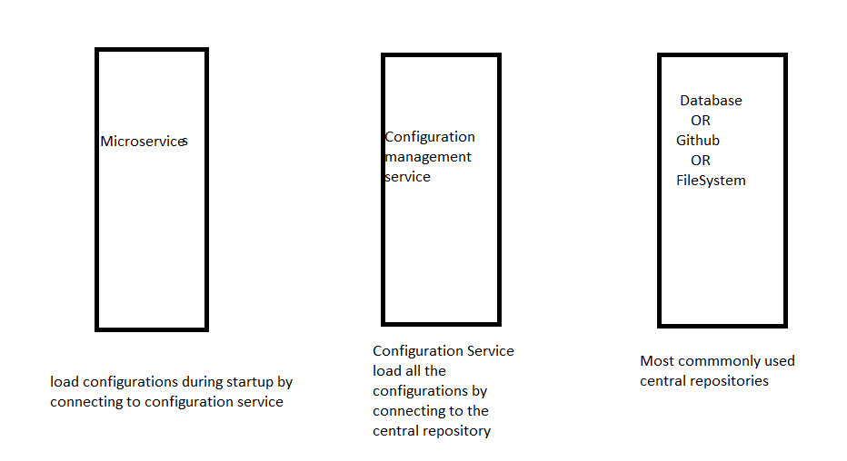

# microservices-config
config backend for microservices

Configuration manangement consist of below Architecture

Spring cloud Config 
------------------

 this is the sub project of the Spring cloud this will help us to manage the external properties 
 for applications across all environment
 

config cloud config server features
-----------------------------------
* HTTP, resource based API for external configuration (name value pairs , or equivalent yanl content)
* encrypt and decrypt property value
* Embeddable easily in spring boot application  using @EnableConfigServer

config client features
---------------------
* bind to the config server and initialize the Spring environment with remote property sources
* Encrypt and decrypt property values

Retry Pattern 
-------------
 

rate limiter
------------

Order of starting the microservices is 
-----------------------------------------
 Config server 
 Eureka Server
 Loan service
 Cards Service
 Account Service

